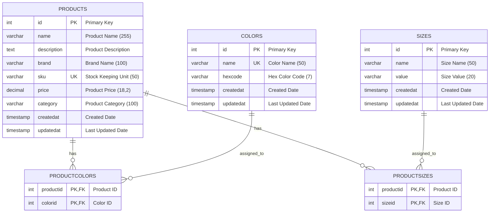

# Product Management Database Schema

## Overview
This document describes the PostgreSQL database schema for the Product Management system. The schema follows a normalized relational design with many-to-many relationships between products, colors, and sizes.

## Database Information
- **Database Engine**: PostgreSQL 16
- **Character Set**: UTF-8
- **Naming Convention**: snake_case (lowercase with underscores)

## Entity Relationship Diagram

## Table Definitions

### Products Table
The main table storing product information.

| Column | Type | Constraints | Description |
|--------|------|-------------|-------------|
| id | int | PRIMARY KEY, AUTO_INCREMENT | Unique product identifier |
| name | varchar(255) | NOT NULL | Product display name |
| description | text | NULL | Detailed product description |
| brand | varchar(100) | NOT NULL | Product brand/manufacturer |
| sku | varchar(50) | NOT NULL, UNIQUE | Stock Keeping Unit |
| price | decimal(18,2) | NOT NULL | Product price |
| category | varchar(100) | NOT NULL | Product category |
| createdat | timestamp | NOT NULL | Record creation timestamp |
| updatedat | timestamp | NOT NULL | Last update timestamp |

### Colors Table
Stores available color options for products.

| Column | Type | Constraints | Description |
|--------|------|-------------|-------------|
| id | int | PRIMARY KEY, AUTO_INCREMENT | Unique color identifier |
| name | varchar(50) | NOT NULL, UNIQUE | Color name (e.g., "Red", "Blue") |
| hexcode | varchar(7) | NOT NULL | Hex color code (e.g., "#FF0000") |
| createdat | timestamp | NOT NULL | Record creation timestamp |
| updatedat | timestamp | NOT NULL | Last update timestamp |

### Sizes Table
Stores available size options for products.

| Column | Type | Constraints | Description |
|--------|------|-------------|-------------|
| id | int | PRIMARY KEY, AUTO_INCREMENT | Unique size identifier |
| name | varchar(50) | NOT NULL | Size name (e.g., "Small", "Large") |
| value | varchar(20) | NOT NULL | Size value (e.g., "S", "L", "42") |
| createdat | timestamp | NOT NULL | Record creation timestamp |
| updatedat | timestamp | NOT NULL | Last update timestamp |

### ProductColors Table (Junction Table)
Many-to-many relationship between products and colors.

| Column | Type | Constraints | Description |
|--------|------|-------------|-------------|
| productid | int | PRIMARY KEY, FOREIGN KEY | Reference to products.id |
| colorid | int | PRIMARY KEY, FOREIGN KEY | Reference to colors.id |

**Constraints:**
- Composite Primary Key: (productid, colorid)
- Foreign Key: productid → products(id) ON DELETE CASCADE
- Foreign Key: colorid → colors(id) ON DELETE CASCADE

### ProductSizes Table (Junction Table)
Many-to-many relationship between products and sizes.

| Column | Type | Constraints | Description |
|--------|------|-------------|-------------|
| productid | int | PRIMARY KEY, FOREIGN KEY | Reference to products.id |
| sizeid | int | PRIMARY KEY, FOREIGN KEY | Reference to sizes.id |

**Constraints:**
- Composite Primary Key: (productid, sizeid)
- Foreign Key: productid → products(id) ON DELETE CASCADE
- Foreign Key: sizeid → sizes(id) ON DELETE CASCADE

## Database Indexes

### Performance Indexes
The following indexes are created for optimal query performance:

#### Products Table Indexes
- `IX_products_name` - Single column index on name
- `IX_products_description` - Single column index on description (for search)
- `IX_products_brand` - Single column index on brand
- `IX_products_category` - Single column index on category
- `IX_products_sku` - Unique index on SKU
- `IX_products_price` - Single column index on price

#### Composite Indexes (Products)
- `IX_products_category_brand` - For filtering by category and brand
- `IX_products_category_price` - For category-based price sorting
- `IX_products_brand_price` - For brand-based price sorting
- `IX_products_createdat_category` - For recent products by category
- `IX_products_name_description_brand` - For full-text search optimization

#### Colors Table Indexes
- `IX_colors_name` - Unique index on color name
- `IX_colors_hexcode` - Index on hex code for color lookups

#### Sizes Table Indexes
- `IX_sizes_name` - Index on size name for filtering

## Relationships

### Many-to-Many Relationships

1. **Products ↔ Colors**
   - Junction Table: `productcolors`
   - Allows a product to have multiple colors
   - Allows a color to be used by multiple products
   - Cascade delete: Removing a product or color removes related associations

2. **Products ↔ Sizes**
   - Junction Table: `productsizes`
   - Allows a product to have multiple sizes
   - Allows a size to be used by multiple products
   - Cascade delete: Removing a product or size removes related associations

## Data Integrity

### Constraints
- **Primary Keys**: All tables have auto-incrementing integer primary keys
- **Foreign Keys**: Junction tables enforce referential integrity
- **Unique Constraints**: SKU and color names are unique
- **Not Null**: Required fields are enforced at database level
- **Cascade Deletes**: Orphaned records are automatically cleaned up

### Audit Trail
All entities include automatic timestamp tracking:
- `createdat`: Set when record is first created
- `updatedat`: Updated automatically on every modification

## Query Optimization

### Search Performance
The schema is optimized for common query patterns:

1. **Product Search**: Indexes on name, description, brand, and category
2. **Category Filtering**: Category index and composite category indexes
3. **Price Sorting**: Price index and price-based composite indexes
4. **Full-Text Search**: Multi-column index for search across name, description, and brand

### Expected Query Patterns
- Search products by name/description/brand
- Filter products by category and/or brand
- Sort products by price within categories
- Find products with specific colors/sizes
- Retrieve recent products by category

## Migration History
- `20250918035437_InitialCreate` - Initial schema creation
- `20250918043217_AddPerformanceIndexes` - Added performance optimization indexes

## Statistics
- **Total Tables**: 5 (3 main entities + 2 junction tables)
- **Total Indexes**: 17 (including primary keys)
- **Foreign Key Relationships**: 4
- **Unique Constraints**: 2 (SKU, color name)